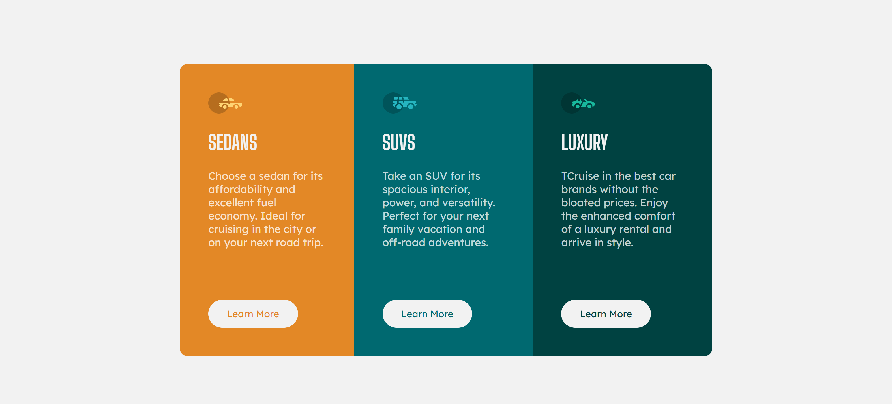

# Frontend Mentor - 3-Column Preview Card Component Solution

This is a solution to the [3-Column Preview card component challenge on Frontend Mentor](https://www.frontendmentor.io/challenges/3column-preview-card-component-pH92eAR2-). Frontend Mentor challenges help you improve your coding skills by building realistic projects.

## Table of contents

- [Overview](#overview)
  - [Screenshot](#screenshot)
  - [Links](#links)
- [My process](#my-process)
  - [Built with](#built-with)
- [Author](#author)

## Overview

### Screenshot

### Links

- Solution URL: [3-Column Preview Card](https://www.frontendmentor.io/solutions/3column-preview-card-component-BkTuPJLS9)

## My process

### Built with

- Semantic HTML5 markup
- CSS custom properties
- Google Fonts

## Author

- Frontend Mentor - [@AyaZayed](https://www.frontendmentor.io/profile/AyaZayed)
- Linkedin - [Aya Zayed](https://www.linkedin.com/in/aya-zayed-2000/)
